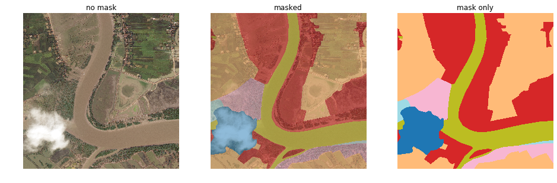

# Land Cover Segmentation

Aim: Automatic categorization and segmentation of land cover are of great importance for sustainable development, autonomous agriculture, and urban planning. This problem is defined as a multi-class segmentation task to detect areas of urban, agriculture, rangeland, forest, water, barren, and unknown (see the [DEEPGLOBE - CVPR18](http://deepglobe.org/challenge.html) challenge)

Data: high-resolution satellite image datasets (courtesy of [DigitalGlobe](http://deepglobe.org/challenge.html)) - one can download the data by registering for the challenge in the above link.
- The training data for Land Cover Challenge contains 803 satellite imagery in RGB, size 2448x2448.
-  The imagery has 50cm pixel resolution, collected by DigitalGlobe's satellite.

Each satellite image is paired with a mask image for land cover annotation. The mask is a RGB image with 7 classes of labels, using colour-coding (R, G, B) as follows.
- Urban land: 0,255,255 - Man-made, built-up areas with human artefacts (can ignore roads for now which is hard to label)
- Agriculture land: 255,255,0 - Farms, any planned (i.e. regular) plantation, cropland, orchards, vineyards, nurseries, and ornamental horticultural areas; confined feeding operations.
- Rangeland: 255,0,255 - Any non-forest, non-farm, green land, grass
- Forest land: 0,255,0 - Any land with x% tree crown density plus clear-cut.
- Water: 0,0,255 - Rivers, oceans, lakes, wetland, ponds.
- Barren land: 255,255,255 - Mountain, land, rock, dessert, beach, no vegetation
- Unknown: 0,0,0 - Clouds and others

## Example of a mask

Above is an example of the land cover class label (right) and corresponding original image (left) pairs from an interesting area.
